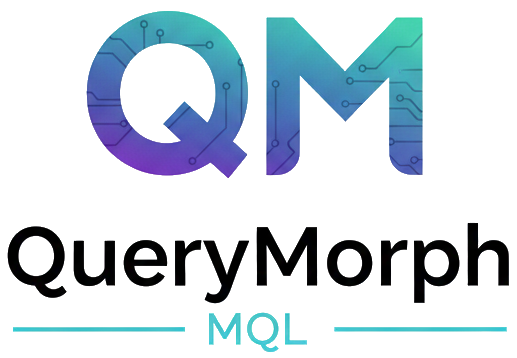

A high-performance, isomorphic Query-to-Code engine. It provides the **Morph Query Language** (MorphQL) to transform structural data (JSON, XML, or Objects) by compiling queries into specialized, pure JavaScript functions.

## Current status

Please note that this project is in a very early stage and is not ready for production use. It is currently under active development and subject to change.
Packages are NOT published to npm yet.

## Key Features

- 🚀 **Performance**: Compiles DSL to native JS for maximum execution speed.
- 🌐 **Isomorphic**: Runs seamlessly in Node.js and the Browser.
- 🧩 **Format Agnostic**: Input and output can be JSON, XML, or raw Objects.
- ➗ **Expressions**: Support for arithmetic, string concatenation, and unary minus.
- 🔀 **Conditional Logic**: `if` function with comparison and logical operators.
- 🛠️ **Modular Functions**: Extensible function registry (e.g., `substring`, `xmlnode`, `extractNumber`, `uppercase`, `lowercase`, `text`, `number`).
- 🔄 **Structural Mapping**: Easy handling of nested objects and arrays (`multiple`).
- 🎨 **Playground**: Real-time editor to test and visualize generated code.

## Installation

```bash
npm install @morphql/core
```

## Usage Example

```typescript
import { compile, morphQL } from "@morphql/core";

// 1. Structural Transformation with Tagged Template
const query = morphQL`
  from object to json
  transform
    set fullName = firstName + " " + lastName
    set shortSku = substring(sku, 0, 3)
    set total = (price * amount) - discount
    section header(
      set id = orderId
    )
`;

const engine = await compile(query);

const source = {
  firstName: "John",
  lastName: "Doe",
  sku: "ABC12345",
  price: 100,
  amount: 2,
  discount: 10,
  orderId: "ORD-99",
};

const result = engine(source);
console.log(result);
// Output: JSON string with fullName, shortSku, total, and header object

// 2. Pure Format Conversion (No Transform)
const convertQuery = morphQL`from json to xml`;
const convertEngine = await compile(convertQuery);
const xmlResult = convertEngine('{"foo":"bar"}');
// Output: <root><foo>bar</foo></root>

// 3. Subquery Sections (Format Conversion in Sections)
const subqueryEngine = morphQL`
  from json to object
  transform
    set orderId = id
    section metadata(
      from xml to object
      transform
        set name = root.productName
        set price = number(root.cost)
    ) from xmlString
`;
const subqueryResult = await compile(subqueryEngine);
// Parses XML field and transforms it within the section
```

> **💡 Tip**: Use the `morphQL` tagged template for better syntax highlighting in VSCode! Install the [MorphQL VSCode extension](./packages/vscode-extension) for the best development experience.

## MorphQL Reference

Morph Query Language (MorphQL) is a declarative DSL for structural data transformation.

### Actions (Statements)

Actions are the top-level commands used inside the `transform` block or `section` blocks.

- **`set [target] = [expression]`**: Sets a property on the target object.
- **`section [multiple] [name]( [subquery] [actions] ) [from [path]]`**: Creates a nested object or array.
  - `multiple`: If present, treats the source as an array and maps each item.
  - `subquery`: Optional nested query for format conversion: `from [format] to [format] [transform]`
  - `from [path]`: Optional path to shift the context of the source data.
  - Example with subquery: `section metadata( from xml to object transform set name = root.productName ) from xmlString`
- **`clone([fields...])`**: Clones the entire source object or specific fields into the target.
- **`delete [field]`**: Removes a property from the target object (useful after `clone`).
- **`define [alias] = [expression]`**: Defines a local variable/alias that can be used in subsequent expressions within the same scope.
- **`if ([condition]) ( [thenActions] ) [else ( [elseActions] )]`**: Executes a block of actions conditionally.

### Escaped Identifiers

Use backticks (`` `fieldname` ``) to use reserved keywords or special characters (dashes, spaces, etc.) as identifiers:

```morphQL
transform
  set `multiple` = true
  set `order-id` = root.`external-id`
```
Backticks can even be escaped with \ when needed in a field name.\
Natural template string escape of backticks is also supported in the vscode extension and does not break synthax highlighting.

### Functions

Functions can be used within expressions to calculate values.

| Function                              | Description                                               | Example                           |
| :------------------------------------ | :-------------------------------------------------------- | :-------------------------------- |
| `substring(str, start, [length])`     | Extracts a part of a string. Supports negative indices.   | `substring(sku, 0, 3)`            |
| `if(cond, trueVal, falseVal)`         | Ternary-like expression.                                  | `if(age >= 18, "adult", "minor")` |
| `text(val)`                           | Converts a value to a string.                             | `text(123)`                       |
| `replace(str, search, replace)`       | Replaces occurrences in a string.                         | `replace(name, " ", "_")`         |
| `split(str, [sep], [limit])`          | Splits a string into an array. Default separator is `""`. | `split(sku, "-")`                 |
| `number(val)`                         | Converts a value to a number.                             | `number("42")`                    |
| `extractnumber(str)`                  | Extracts the first numeric sequence from a string.        | `extractnumber("Price: 100USD")`  |
| `uppercase(str)`                      | Converts string to uppercase.                             | `uppercase("hello")`              |
| `lowercase(str)`                      | Converts string to lowercase.                             | `lowercase("HELLO")`              |
| `xmlnode(val, [attrKey, attrVal...])` | Wraps a value for XML output with optional attributes.    | `xmlnode(content, "id", 1)`       |
| `to_base64(val)`                      | Encodes a string to Base64 (isomorphic).                  | `to_base64("hello")`              |
| `from_base64(val)`                    | Decodes a Base64 string (isomorphic).                     | `from_base64("aGVsbG8=") `        |
| `aslist(val)`                         | Ensures a value is an array (useful for XML).             | `aslist(items)`                   |

### Operators

MorphQL supports standard operators for expressions:

- **Arithmetic**: `+`, `-`, `*`, `/`
- **Comparison**: `==`, `===`, `!=`, `!==`, `<`, `>`, `<=`, `>=`
- **Logical**: `&&` (and), `||` (or), `!` (not)
- **Grouping**: `( )` for precedence.

---

## Array Mapping

`section multiple items( set sku = itemSku )` from `itemsArray`

## Monorepo Structure

This repository uses **npm workspaces** to manage multiple packages:

```
morphql/
├── packages/
│   ├── core/        # @morphql/core - The main library
│   ├── playground/  # @morphql/playground - Interactive editor
│   ├── cli/         # @morphql/cli - Command line interface
│   └── server/      # NestJS REST API server
├── package.json     # Workspace configuration
└── README.md
```

## CLI Usage

You can use `morphql` directly from the command line:

```bash
# Transform a file
npx @morphql/cli --from ./data.json --to ./output.xml -q "from json to xml"

# Transform raw input to stdout
npx @morphql/cli -i '{"a":1}' -q "from json to xml"
```

For more details, see the [CLI README](./packages/cli/README.md).

## Server API

Deploy `morphql` as a stateless REST API for server-side transformations:

```bash
# Quick start with Docker Compose
cd packages/server
docker compose up -d
```

The server exposes HTTP endpoints for executing transformations:

```bash
# Execute a transformation
curl -X POST http://localhost:3000/v1/execute \
  -H "Content-Type: application/json" \
  -d '{
    "query": "from json to json transform set firstName = split(fullName, \" \")[0]",
    "data": { "fullName": "John Doe" }
  }'

# Response: {"success":true,"result":{"firstName":"John"},"executionTime":2.5}
```

**Features**:

- 🚀 Stateless & horizontally scalable
- ⚡ Redis caching for compiled queries
- 🔐 Optional API key authentication
- 📊 Swagger docs at `/api`

For more details, see the [Server README](./packages/server/README.md).

## Development

### Prerequisites

```bash
npm install    # Installs all workspace dependencies
npm run build  # Builds @morphql/core
```

### Available Scripts (from root)

| Command              | Description                     |
| -------------------- | ------------------------------- |
| `npm run build`      | Build the core library          |
| `npm run test`       | Run tests for core library      |
| `npm run playground` | Start the playground dev server |
| `npm run server`     | Start the API server (dev mode) |
| `npm run dev`        | Watch mode for core library     |
| `npm run build:all`  | Build all packages              |
| `npm run test:all`   | Run tests for all packages      |

### Development Workflow

```bash
# Terminal 1: Watch library changes
npm run dev

# Terminal 2: Run playground
npm run playground
```

Changes to `@morphql/core` are automatically picked up by Vite's HMR.

## Packages

| Package                                          | Description               |
| ------------------------------------------------ | ------------------------- |
| [@morphql/core](./packages/core)             | The transformation engine |
| [@morphql/playground](./packages/playground) | Interactive web editor    |
| [@morphql/cli](./packages/cli)               | Command line interface    |
| [server](./packages/server)                      | NestJS REST API server    |

## License

MIT
